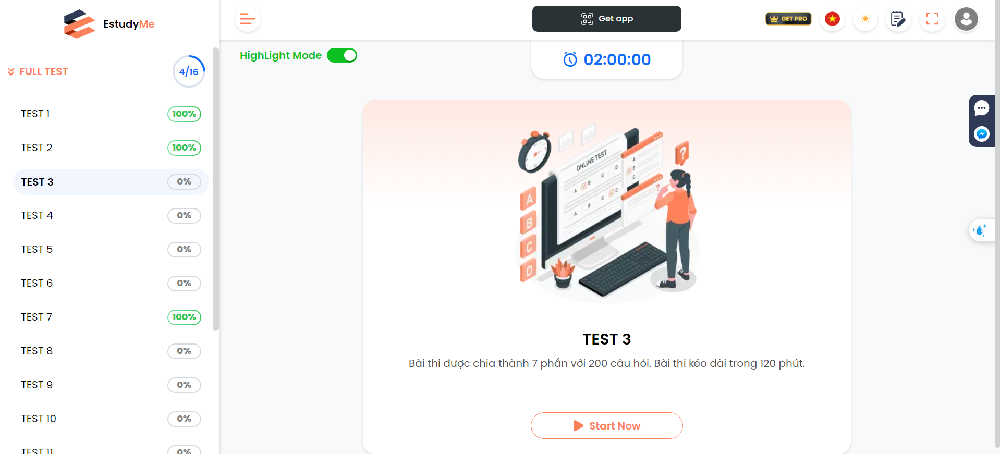
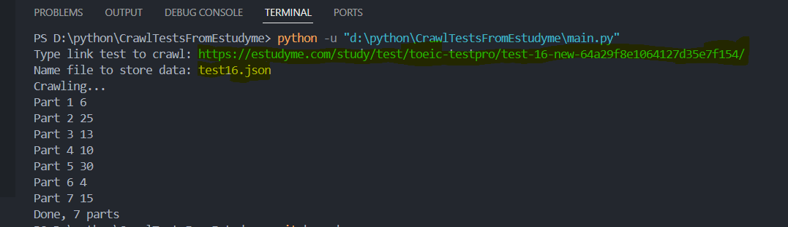

# Toeic-Test-Crawler

- It's a simple tool for crawling Toeic tests from [EStudyMe](https://estudyme.com/study/test/toeic-testpro/test-1-62b69492bbc57b27fe10f7ac/)
- Data including all questions of 7 parts is taken from HTML and saved in the **ToeicTests** folder as a json file

## Requirements

This tool requires the following libraries:
- [Playwright](https://playwright.dev/python/docs/intro)
- [BeautifulSoup](https://scrapeops.io/python-web-scraping-playbook/installing-beautifulsoup/)

## Usage

- Run file `main.py`
- Enter the link of a full test on the [EStudyMe](https://estudyme.com/study/test/toeic-testpro/test-1-62b69492bbc57b27fe10f7ac/) website (Ex: https://estudyme.com/study/test/toeic-testpro/test-16-new-64a29f8e1064127d35e7f154/)
- Enter the file name you want to save data (Ex: test_16.json). The file will be automatically created in the **ToeicTests** folder.

## Build with

- [Playwright](https://playwright.dev/python/docs/api/class-page) - Methods to interact with a single tab in a Browser
- [BeautifulSoup](https://beautiful-soup-4.readthedocs.io/en/latest/) - Pulling data out of HTML and XML files.

